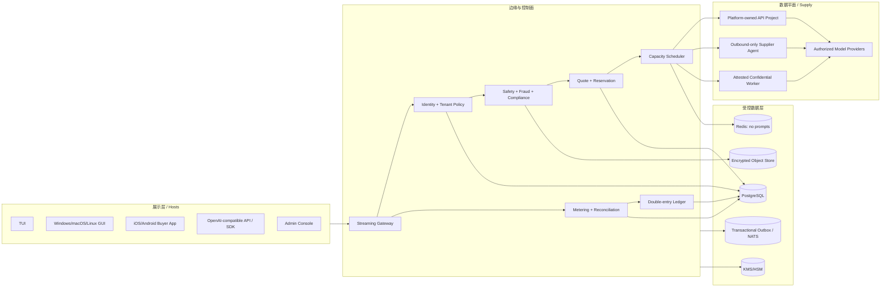
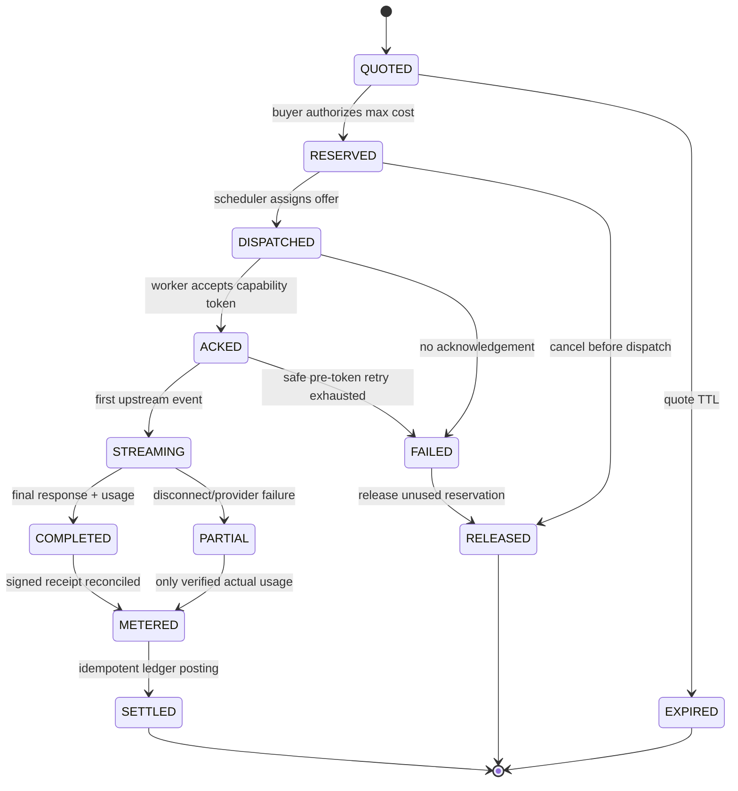

# 算力共享平台总体设计（研究与决策稿）

- 状态：Draft，进入研发前必须完成 Go/No-Go 评审
- 基线仓库：`JayM0826/token-streaming`，commit `317b4f67e4f7da7c53bb759cf45d0b498447d247`
- 设计日期：2026-08-24
- 研发执行：遵循 Token Streaming 工程规范，AI 辅助研发统一使用本地 Codex：GPT-5.6 Sol、`xhigh`、Fast
- 产品假设：运行时保持 Provider/模型/推理档位可插拔，由已接受的容量报价决定
- 首发假设：仅在模型供应商明确支持且公司具备服务资格的地区运营

> 这是一份工程与商业设计稿，不构成法律、税务或金融意见。涉及订阅转售、跨境数据、生成式 AI 服务备案和资金结算的结论，上线前必须由目标地区律师、支付机构和模型供应商书面确认。

## 1. 结论先行

这个项目可以做，但必须把“本地 Codex 研发方式”和“客户推理产品”彻底分开。

研发执行面复用 Token Streaming 的无头内核、协议优先、模块清单、补丁/检查点和测试门禁规范，并由本地 Codex 完成 AI 辅助设计、编码和评审。产品数据面则是“经授权的模型推理容量交易与调度平台”，不能把开发者 Codex 会话当成客户请求网关。

平台可以接入企业和个人供应方，但交易对象必须是可授权、可隔离、可计量的容量，而不是账号、Cookie、API Key 或不可核验的会员消息次数。订阅型容量只有在上游明确允许第三方服务/转售并提供正式接入和计量机制时才启用对应 Adapter；其余情况默认拒绝。

四项不可妥协的产品决策：

1. 不收集供应方账号密码、会话 Cookie、可复用 OAuth 登录态或明文 API Key；正式连接器必须使用上游批准的授权方式。
2. 企业和个人采用同一准入模型：授权证明、KYC/KYB、独立限额、可验证计量、数据处理条款和税务路径缺一不可。
3. 客户请求只走与报价绑定的 Provider Adapter；本地 Codex 只服务研发，不进入产品数据平面。
4. 地区资格按 `provider + model + tier + offer` 判断；任何单一供应商的地区限制都不能被泛化成整个平台的产品边界，也不能通过代理规避。

推荐的首发路径是：

```text
平台自有、经授权的单一供应源
        -> 单供应源闭环验证
        -> 企业与个人供应方统一准入
        -> 第二和第三个经授权供应源
        -> 多主体容量市场
        -> 多 Provider、多模型容量市场
```

## 2. 产品边界

### 2.1 平台真正交易的对象

交易对象不是账号，也不是不可核验的“剩余算力”，而是一个有约束的容量报价 `CapacityOffer`：

```text
模型 + 服务档位 + 地区 + 数据等级 + 时间窗
+ RPM/TPM/并发上限 + 最大预算 + 单位报价 + SLA
+ 供应授权状态 + 节点可信等级
```

每个订单是一次有上限的推理任务 `InferenceJob`。订单在执行前预留预算和容量，结束后根据供应商/API 返回的最终用量回执结算。

### 2.2 允许和禁止的供应类型

| 供应类型 | V1 | 原因/前置条件 |
|---|---:|---|
| 平台自有的授权 Provider 项目 | 允许 | 官方接口、合同主体清晰、可做容量与成本核对 |
| 企业供应方的独立 API 项目/服务账号 | 条件允许 | 必须有书面授权、独立项目、限额、审计和数据处理协议 |
| 官方分销/转售渠道容量 | 条件允许 | 以渠道合同的转售范围为准 |
| 许可证允许商业推理服务的自托管模型 | 条件允许 | 通过同一 Provider SPI、计量、隔离和安全门禁 |
| 个人开发者 API/正式供应账号 | 允许 | 与企业同一领域模型；需要供应商许可、KYC、税务、独立限额和可验证账单 |
| 个人消费级订阅容量 | 条件允许 | 个人是 V1 一等供应方；具体订阅需上游允许第三方服务/转售，并提供正式授权与计量连接器 |
| 用户粘贴 API Key 到普通客户端 | 禁止 | 官方文档要求 API Key 不得共享或暴露在客户端 |
| 浏览器自动化、Cookie 中继、逆向私有接口 | 禁止 | 高入侵、高封号、高数据泄漏风险 |

### 2.3 用户角色

- 购买方：个人、团队或企业，通过 OpenAI-compatible API、TUI、桌面或移动端购买推理服务。
- 供应方：提供合规容量的企业或经营者；只管理报价、容量和结算，不接触购买方身份。
- 平台运营方：负责准入、撮合、计量、账务、风控、争议处理和审计。
- 模型供应商：最终执行推理；其地区、使用政策、数据政策和限流规则始终优先。

## 3. 基座仓库审计

当前 `token-streaming` 是“CLI-first agentic coding runtime”，不是推理代理或算力市场。它适合复用的部分和必须替换的部分如下。

| 现有能力 | 结论 | 处理方式 |
|---|---|---|
| `packages/protocol` 事件与 Provider 契约 | 可复用思想 | 扩展成版本化网络协议，不能继续只传整段字符串 |
| `packages/core` headless runtime | 可复用边界模式 | 保留原 coding runtime；新建 marketplace domain，避免语义污染 |
| Provider adapter | 可复用骨架 | 增加流式、幂等、档位、身份、用量、取消和重试语义 |
| 权限检查和审批 | 可复用模式 | 从文件/命令策略扩展为租户、供应、数据和财务策略 |
| append-only session events | 可复用事件思路 | 本地明文 JSONL 改为加密数据库 + transactional outbox + 防篡改审计 |
| CLI/TUI 宿主思路 | 可复用 | CLI 保留为运维/开发工具，新增真正的交互式 TUI |
| 测试与 package readiness | 质量良好 | 基线 233 项测试全部通过，继续作为回归门禁 |
| 多租户、鉴权、账务、调度、结算 | 缺失 | 新增领域模块 |
| SSE/流式转发 | 缺失 | 新建 streaming gateway；现有 Provider 会等完整 JSON |
| 密钥托管、KMS、供应节点 | 缺失 | 新建 credential broker 与 supplier agent |
| 商业许可证 | 缺失 | 商用/分发前必须由版权所有者补许可证或书面授权 |

### 3.1 与算力市场目标的已知代码差距

- `ModelRequest` 目前只有少量通用字段，不能表达版本化能力、供应报价、数据等级、流式事件、取消和最终用量回执。
- 现有 Provider 以完整响应为主，缺少统一 SSE/事件流、幂等、档位校验、能力探测和供应方签名回执。
- 本地 Codex Provider 属于研发执行能力；市场运行时需要独立 Provider SPI 和部署依赖规则，防止误接客户流量。
- 现有 Provider 的固定超时和错误模型不适合多供应商、长流式响应和部分完成结算。
- 现有 telemetry 只有 input/output token 汇总，没有 cached、reasoning、tool、长上下文和供应报价成本。
- 当前 event log 会保存用户消息、工具摘要和补丁信息，不能直接用于多租户生产环境。

## 4. 目标架构

采用“协议优先的模块化单体 + 独立数据平面 + 最小权限供应代理”。早期不拆成大量微服务；以包边界、数据库所有权和事件契约保证未来可拆分。



### 4.1 控制面与数据面

控制面只处理：身份、租户策略、容量摘要、报价、路由、用量、账务和审计元数据。

数据面处理：购买方输入、模型流式事件和供应商凭据。默认模式下平台网关会看到请求明文，因此只能承诺传输/静态加密和严格访问控制，不能宣传“平台不可见的端到端加密”。只有通过远程证明的机密计算模式，才能提供买方到可信执行环境的 HPKE 加密；模型供应商仍会看到模型输入。

### 4.2 核心包与应用边界

建议保留现有 monorepo，并新增以下边界：

```text
apps/
  gateway/                 # OpenAI-compatible HTTP/SSE API
  control-plane/           # 模块化单体入口、管理 API
  tui/                     # 购买、供应与运维 TUI
  desktop/                 # Tauri + React，Windows/macOS/Linux
  mobile/                  # React Native/Expo，iOS/Android，首期只做购买方
  admin/                   # 内部风控、准入、争议和财务控制台

packages/
  protocol/                # 版本化命令、事件、JSON Schema/OpenAPI
  client-core/             # 无 UI 的状态机、SDK、缓存、错误模型
  marketplace-domain/      # Offer、Reservation、Job、Settlement 聚合
  scheduler/               # 约束匹配，不读取密钥和提示词
  metering/                # 用量回执、费率卡、对账
  ledger/                  # 双重记账、退款、准备金、供应方应付
  policy/                  # 租户/地区/数据/供应/工具/预算策略
  crypto/                  # envelope encryption、签名、密钥版本
  provider-contract/       # 规范化能力、请求、事件、用量和错误契约
  provider-openai/         # OpenAI 官方协议适配器
  provider-*/              # 其他获准云模型与自托管模型适配器
  storage-postgres/        # repository + outbox 实现
  observability/           # 脱敏指标、trace、审计事件

native/
  supplier-agent/          # Rust；出站连接、凭据隔离、沙箱、签名更新
```

现有 coding runtime 不删除、不强行改名。它可以继续服务开发流程；市场运行时作为新的 bounded context 并行演进。

### 4.3 UI 与内核隔离规则

1. 所有 UI 只依赖 `client-core` 和公开协议，不直接 import 数据库、Provider 或领域 repository。
2. TUI、桌面、移动端看到相同的命令、事件、错误码和权限模型。
3. 服务端协议使用显式 `schema_version`；新增字段必须向后兼容，破坏性变化开新 major endpoint。
4. UI 可被替换，领域状态机、计费和安全决策不得复制到 UI。
5. 移动端首期只作为购买方客户端。手机后台、散热、电池和商店政策不适合作为可靠供应节点。

## 5. 请求、流式和结算状态机



关键语义：

- 每个外部请求必须带 `Idempotency-Key`，内部生成不可变 `request_id`、`attempt_id`。
- 投递采用 at-least-once；账务通过唯一约束和幂等 posting 实现“业务效果只发生一次”，不宣传网络层 exactly-once。
- 只有首个输出 token 之前可以自动换供应源重试。首个 token 之后不自动重放，避免重复扣费和拼接错误。
- 购买方先授权最大成本；`max_output_tokens` 强制存在，最终按实际可验证用量结算并释放差额。
- 断流后若供应商返回最终用量，只结算已确认的实际用量；没有可信回执时进入人工/自动对账，不直接扣全额。
- 同一多轮会话默认粘滞在同一供应项目和数据地区，跨供应迁移必须重新确认隐私和价格。

### 5.1 内部事件信封

每个事件至少包含：

```text
schema_version, event_id, tenant_id, request_id, attempt_id,
sequence, occurred_at, event_type, payload_hash, privacy_class,
producer_identity, signature_key_version
```

公开给客户端的流式事件只包含必要内容。账务、风控和供应内部字段不能穿透到购买方；购买方身份和原始提示词不能穿透到供应方控制台。

## 6. 研发执行面与产品推理面

### 6.1 本地 Codex 研发配置

仓库根目录的 `.codex/config.toml` 固定研发默认值：

```toml
model = "gpt-5.6-sol"
model_reasoning_effort = "xhigh"
service_tier = "fast"
```

这里的 `fast` 是 Codex Fast mode；它与产品 Provider 可能提供的 `ultrafast` 等服务档位不是同一项配置。该文件只控制受信任项目中的本地 Codex 会话。

研发规则：

- 设计、编码、重构、评审和文档等 AI 辅助工作使用本地 Codex，不把商业 Provider API Key 当作研发 Agent 凭据。
- `AGENTS.md` 与 `.ai/` 描述仓库规则；每个模块继续用 `README.md + module.yaml` 声明边界、依赖、公开 API、测试和不变量。
- 本地 Codex 产生的修改仍必须经过补丁、测试和审查门禁，不能绕过权限与供应链检查。
- 开发者本机、Codex 登录态、对话记录和配置不得成为生产依赖，也不得接收客户提示词。

### 6.2 产品规范化能力契约

产品不固定某个模型。报价冻结以下规范化选择：

```text
provider_id / provider_project / model / model_revision
reasoning_profile / service_tier / region / data_policy
input_limit / output_limit / tool_allowlist
rate_card_id / fallback_policy / capability_snapshot
```

具体规则：

- 上线前对每个供应项目执行最小能力探测；运行时核验实际模型、档位和用量语义。
- 默认 `fallback_policy=strict`：与已接受报价不符时失败并释放未用预留，不静默换模型、降档或跨地区。
- 购买方显式允许替代时，也必须重新报价并重新确认价格、数据策略和 SLA。
- 推理 token、缓存、长上下文、工具、图片、音频或计算时长按各 Provider 的真实计费单位进入费率卡。
- 支持安全标识的 Provider 使用租户级 HMAC 伪标识；不发送邮箱、手机号或原始用户 ID。
- 缓存命名空间必须租户隔离；没有可验证隔离能力时关闭跨请求缓存。

## 7. 调度器设计

调度是多约束匹配，不是单纯最低价：

```text
eligible = authorization
        AND provider/model/capabilities satisfy accepted_quote
        AND service_tier == accepted_quote.service_tier
        AND region/data-policy match
        AND capacity available
        AND quote still valid
        AND reliability above threshold
        AND credential/attestation healthy

score = landed_cost
      + latency_penalty
      + reliability_penalty
      + concentration_penalty
      + data_risk_penalty
```

硬约束先过滤，软指标再评分。价格不能覆盖安全、地区或授权缺失。

容量库存按 `provider_project + model + tier + region + minute_bucket` 维护；预留通过数据库条件更新或原子脚本完成，防止配额双花。Redis 只做短时视图，PostgreSQL 是最终真相。

需要限制单一供应方集中度，避免最低价供应方故障拖垮全站。默认每个租户和全站都有供应占比上限。

## 8. 供应方对接

### 8.1 授权账户直连模式（企业与个人，V1）

- 每个企业或个人供应方使用独立 Provider Project、正式供应账号或上游批准的订阅连接器。
- 个人与企业进入同一 `Supplier`、`ProviderAuthorization` 和 `CapacityOffer` 状态机；差异只存在于 KYC/KYB、受益所有人、税务和 payout 验证策略。
- 正式授权产生的必要凭据只进入独立 Credential Broker，并以 KMS/HSM 按供应方和环境分域加密；领域事件只保存不可反推凭据的引用。
- 供应方只能看到聚合用量、收益和错误率，不能读取客户提示词。
- 项目级 spend/rate limits 与平台 offer 上限双重限制。
- 供应合同明确数据处理、可用地区、内容政策、事故通知和删除义务。
- `ProviderAuthorization` 明确限定模型、地区、数据等级、有效期和容量上限；`CapacityOffer` 只能收窄，不能扩大授权范围。
- 每次发布报价都重新检查 KYC/KYB 和授权有效性，不能把一次激活当作永久通行证。
- 当前领域切片只开放 P0/P1；P2/P3 在保留期、驻留、ZDR 和专项审批策略进入协议前 fail-closed。
- 事件存储对 `event_id`、`causation_id` 和聚合版本做唯一/乐观并发约束；同一命令重试返回已提交结果，不重复产生容量或财务效果。
- 首个可部署实现由 `apps/supplier-node` 提供：控制面以 `gongsuanyun.gateway.v3`、Bearer 身份和 HMAC-SHA256 请求签名调用节点；签名绑定时间戳、一次性 nonce、任务 ID 和精确请求体摘要。公开健康接口只返回就绪状态和协议版本；批准授权前，控制面通过签名的一次性 challenge 验证节点当前 Provider、精确模型、P0/P1 范围与容量覆盖申请。节点只访问运维配置中的 HTTPS Provider 主机和精确模型，不执行工具、Shell 或文件读取，并以元数据日志、内存幂等缓存和本地 RPM/TPM/并发限制收窄授权范围。
- 每个成功响应必须附带 `gongsuanyun.execution-evidence.v1`：绑定订单任务、Provider、购买模型、上游响应中的实际模型、Provider 请求 ID、输入/输出 SHA-256、标准化用量和完成时间，并由节点共享密钥签名。控制面逐项验证后，才在同一原子批次写入执行凭证、用量、买方扣款、供应方收入和平台费。任一字段或签名不匹配时任务失败且不产生结算分录。
- 当前保障等级明确标记为 `node-signed-provider-response`：它能强制官方供应节点代码核对上游响应模型并留下防传输篡改证据，但不是上游 Provider 自己签发的不可抵赖证明。更高保障需要 Provider 官方签名回执、平台托管 Provider Project，或带远程证明的机密计算执行器。
- V1 节点是服务器型 HTTPS 网关，适合具备公网域名的个人或企业服务器。它不是 8.2 所述的桌面出站代理，也不宣称能够防止节点所有者观察进程内明文；P2/P3 因此继续关闭。

### 8.2 出站供应代理模式（后续）

当前已实现 `apps/supplier-agent` 的跨平台本地控制层：复用 supplier-node 内核，提供回环 GUI/TUI、口令派生的 AES-256-GCM 密钥库、安全启停、聚合状态和平台接入资料。首版仍需供应方配置稳定 HTTPS 反向代理或命名隧道，不会自动修改路由器、防火墙或创建第三方账户。平台托管的长连接 relay 仍属于本节后续阶段。

后续高保障原生代理可使用 Rust，并在现有协议和本地安全边界上增加：

- 不监听公网端口；只建立到平台 relay 的出站 mTLS/WebSocket 连接。
- Provider 凭据保存在 OS Keychain/DPAPI/libsecret 或硬件密钥模块中，平台拿不到原始值。
- 每个任务使用短期、单用途 capability token；绑定 `job_id`、模型、档位、预算、截止时间和允许的上游域名。
- 只允许访问白名单 Provider endpoint；禁止任意 URL、shell、插件和本机文件读取。
- 以非管理员账户运行，使用最小临时目录，任务结束立即擦除明文缓存。
- 二进制签名、可验证更新、分批发布、自动回滚；生成 SBOM 和构建 provenance。

这种模式只能保护供应凭据不离开节点，不能保证供应节点所有者看不到任务明文。因此只承载低敏数据，或升级到经远程证明的机密计算节点。

### 8.3 机密计算模式（企业高级档）

- 买方 SDK 验证 worker attestation 后，以 HPKE 加密任务 payload。
- 密钥只释放给通过度量值白名单的 enclave/VM。
- 内容安全、请求构造和 Provider 调用在可信执行环境内完成。
- 平台控制面只看到报价、路由和用量元数据。
- 仍需明确披露最终模型供应商会处理输入；这不是“任何第三方都不可见”。

## 9. 安全与防侵入

### 9.1 安全不变量

1. 任何客户端、日志、崩溃报告、分析系统都不得出现 Provider 密钥。
2. 控制面数据库默认不保存完整提示词或完整输出。
3. 所有跨租户对象访问同时校验 `tenant_id` 和对象归属，不能只相信前端 ID。
4. 所有外部副作用都有幂等键、预算上限和审计事件。
5. 供应节点不接受入站连接，不执行购买方工具，不读取购买方附件之外的资源。
6. 安全、地区、档位或授权验证失败时 fail closed。
7. 财务账本只追加冲正分录，不 update/delete 历史金额。

### 9.2 加密与密钥

| 场景 | 方案 |
|---|---|
| 客户端到网关 | TLS 1.3；移动/桌面启用证书固定的可恢复策略 |
| 服务到服务 | mTLS + 短期 workload identity；按服务和环境隔离 |
| 数据库/对象存储 | AES-256-GCM envelope encryption；每租户/任务 DEK，KMS/HSM 保存 KEK |
| 供应代理凭据 | OS 安全存储或 HSM；不经过控制面；可撤销和轮换 |
| 机密 payload | RFC 9180 HPKE 到经证明的 worker 公钥 |
| 审计 | 事件哈希链 + 签名 + WORM 保留；描述为“可检测篡改”，不描述为绝对不可篡改 |

密钥版本写入密文元数据；轮换不要求一次性重加密全部数据。生产、预发、开发使用完全不同的信任根。

### 9.3 主要威胁与控制

| 威胁 | 主要控制 |
|---|---|
| 恶意购买方耗尽供应账号 | 预授权、每租户 RPM/TPM/并发/金额上限、异常检测、熔断 |
| 恶意供应方伪造用量 | Provider request id、双方签名回执、抽样核对供应商账单、T+N 结算 |
| 供应方窃取提示词 | 平台托管或授权直连优先、最小日志、机密计算档、合同与审计 |
| 平台内部人员访问内容 | JIT 权限、双人审批、break-glass 审计、字段级加密 |
| SSRF/工具滥用 | Provider 域名白名单；工具在买方信任域执行，供应代理不执行工具 |
| 重放/重复扣费 | nonce、短期 capability、幂等键、账本唯一约束 |
| 供应链攻击 | 锁定依赖、SBOM、签名制品、provenance、SAST/DAST/secret scan |
| 协议解析攻击 | 流式解析器 fuzz、大小/深度/事件数上限；领域重放遇到未知事件或版本时拒绝并隔离，客户端仅按兼容规则忽略可选展示事件 |
| 节点被入侵后横向移动 | 出站-only、无共享凭据、每任务权限、网络和进程沙箱 |

安全基线采用 NIST SP 800-207 的零信任原则和 OWASP API Security Top 10；每次访问基于用户、设备、服务和资源身份单独授权，不能因为处于“内网”就默认可信。

## 10. 数据与隐私

数据分为四级：

- P0：公开内容，可进入普通授权供应池。
- P1：内部一般数据，只进入通过增强审核的供应项目；审核依据是节点与授权可信度，不是主体类型。
- P2：个人信息/商业机密，只进入指定地区、指定供应商、短保留或 ZDR 项目。
- P3：法律禁止出境或极高敏感数据，默认拒绝；仅在专门合规环境评审后开放。

首个实现切片只接受授权记录明确批准的 P0/P1。上面的 P2/P3 路径是目标架构，不代表当前代码已经开放。

默认保留策略：

- 提示词/输出：网关只做内存流转；默认不持久化。
- 加密断点缓冲：最长 15 分钟，完成或超时后删除。
- 用量、价格、模型、地区、错误码：按账务和审计要求保留，不含内容。
- 安全事件样本：必须单独授权、脱敏、最短保留并有访问审批。
- 用户可请求删除非强制保留数据；财务凭证以法定保留为准并与内容数据分离。

每个 Provider Adapter 必须登记内容使用、训练、滥用监控、保留期、数据驻留、删除和加密能力，报价只允许进入满足购买方数据等级的供应池。以 OpenAI Adapter 为例，API 数据是否用于训练、滥用监控保留期以及 ZDR/数据驻留/EKM 能力都应以该供应项目的实际合同和设置为准，不能把单一请求字段等同于供应商完全不留存。

## 11. 中国相关合规闸门

若未来面向中国大陆公众提供服务，至少需要专项确认：

- 每个候选 Provider、模型和服务档位在中国大陆的可用性、商用授权和终端用户限制；例如 OpenAI 路由必须单独遵守其支持地区要求。
- 《生成式人工智能服务管理暂行办法》下平台是否属于服务提供者，以及安全评估、算法备案/登记、投诉处置和未成年人保护义务。
- 2025-09-01 起实施的 AI 生成合成内容标识要求；UI、API 元数据和文件导出应保留显式/隐式标识能力。
- 《个人信息保护法》下告知、同意、最小必要、委托处理、共同处理和自动化决策义务。
- 向境外模型供应商发送提示词时的数据出境路径、敏感个人信息和重要数据判断。
- 使用持牌支付机构做收款、分账和供应方结算；平台不自行经营可提现储值钱包。
- 电信、互联网信息服务、电子商务、税务和发票许可要求。

Go/No-Go 评审没有书面结论前，不开放相应的中国大陆公网路由或供应方结算。某个境外 Provider 不可用，不代表可以绕过限制，也不代表其他已完成本地合规评审的 Provider 自动被禁止。

## 12. 定价、支付和结算原则

详细公式见 `docs/pricing-and-settlement.zh.md`。总体原则：

1. 不提供“无限量”套餐；会员费换取更低平台费、并发和管理能力，模型成本始终按实际用量计。
2. 费率卡版本化并在报价中冻结；模型供应商调价不能追溯影响已接受报价。
3. 每个 Provider/模型/档位的合同价格，以及长上下文、缓存、推理、媒体、工具和计算时长费用全部计入 landed cost。
4. 买方先确认最大费用，最终按实际用量结算；超额必须停止或二次授权。
5. 供应方按已接受报价和可信回执结算；购买方优惠由平台预算承担，不克扣供应方已完成任务。
6. 供应方收益 T+7/T+30 释放一定准备金，用于账单回补、欺诈和争议；规则必须透明。
7. 使用持牌 PSP 的 marketplace/split payout 能力，平台账本是会计子账，不是支付账户。

## 13. 多端产品顺序

不要同时研发六套产品。推荐顺序：

1. OpenAI-compatible API + 管理 API：先稳定协议、流式和计量。
2. TUI：作为功能参考宿主和运维/供应验证工具。
3. Windows/macOS/Linux GUI：Tauri + React，共享 TypeScript SDK、状态机和设计 token。
4. iOS/Android：React Native/Expo，首期只做购买、对话、账单和告警。
5. 供应方桌面能力：独立 Rust Agent，GUI 只做配置面板，二者不在同一权限进程。

移动端数字服务订阅和用量购买需按 Apple/Google 当地商店支付政策实现；渠道抽成必须进入费率公式，不能通过隐藏跳转规避审核。

## 14. 可维护性策略

- 模块化单体优先：一个部署单元可以包含 identity、quote、scheduler、metering、ledger，但包和数据库访问有明确所有权。
- PostgreSQL 是业务真相；Redis 不存账本、不存提示词、不作为唯一容量依据。
- 使用 transactional outbox 保证领域事务和事件发布一致；规模证明需要后再拆服务。
- 所有金额使用整数最小货币单位或高精度 decimal，禁止 IEEE-754 浮点账务。
- 所有用量使用整数 token/tool unit；费率卡有 `effective_from` 和不可变版本。
- OpenAPI/JSON Schema 生成 SDK；协议兼容性由 consumer-driven contract tests 保证。
- Provider adapter 不泄露上游私有字段到领域层；领域层只认识规范化能力、事件和用量。
- feature flag 按租户和地区发布；数据库迁移遵循 expand/migrate/contract。
- ADR 记录授权边界、协议、账务、安全、降级和地区选择；重大变化必须更新威胁模型。

## 15. 可靠性目标与故障语义

建议 Beta 目标：

| 指标 | 目标 |
|---|---:|
| 平台 API 月可用性 | 99.9% |
| 平台新增首 token 开销 p95 | < 250 ms，不含上游模型耗时 |
| 报价/预留 p95 | < 150 ms |
| 计量到待结算延迟 p99 | < 60 s |
| 重复财务 posting | 0；由唯一约束和对账验证 |
| RPO / RTO | < 5 min / < 30 min |
| 严格档位错配 | 0 个静默降级 |

故障策略：

- 上游 429：按供应项目熔断，不把压力扩散到全部项目。
- 上游 5xx/连接失败：仅首 token 前安全重试；指数退避带 jitter。
- 客户端断开：尝试取消上游；不能确认取消时保留费用预留，等待最终回执。
- 供应节点离线：立即停止新调度；已接受任务按心跳和流状态决定失败或部分完成。
- 费率卡缺失/过期：拒绝报价，不猜价格。
- KMS/策略引擎不可用：拒绝受保护请求，不绕过安全控制。

## 16. 测试与发布门禁

### 16.1 自动化测试

- 领域状态机 property-based tests：任何事件序列都不能产生负预留、重复结算或非法跳转。
- 账本不变量：所有 transaction 借贷平衡；退款和冲正不修改历史分录。
- Provider contract tests：SSE 分片、未知事件、重复事件、partial JSON、429/5xx、超时和取消。
- 协议兼容测试：旧 TUI/桌面/移动端可以安全忽略新字段和新事件。
- 调度仿真：配额竞争、供应集中、报价过期、节点抖动和时钟偏移。
- 模糊测试：SSE parser、JSON Schema、capability token、报价和费率输入。
- 安全测试：BOLA/BFLA、SSRF、资源耗尽、密钥泄漏、租户越权、重放和供应链。
- 隐私测试：日志、trace、崩溃报告和分析事件中不出现原始内容/密钥。
- 灾备演练：定期恢复数据库、对象存储、KMS 备份和账务对账。

### 16.2 发布门禁

- 所有单元/集成/契约测试通过。
- 依赖高危漏洞为 0，或有带到期日和责任人的风险接受。
- SBOM、签名和 provenance 生成并验证。
- 生产能力探测确认报价中的 Provider、模型、能力、服务档位和实际费率卡。
- 安全、隐私、财务和地区策略均有版本并通过审批。
- 供应方合同、DPA、支付分账和事故响应联系人已生效。

## 17. 分阶段路线图（按退出条件，而非日历）

### Phase 0：可行性闸门

- 确认目标国家/地区和公司主体。
- 获得首发 Provider 对业务模式、终端用户、供应容量和转售/代处理方式的书面确认。
- 确认仓库商业许可证或版权所有者授权。
- 用真实合同费率完成 3 组单位经济压力测试。

退出条件：四项全部通过，否则不进入付费研发。

### Phase 1：统一供应方领域与单供应源闭环

- 平台自有授权 API 项目。
- 个人/企业统一注册、KYC/KYB、Provider 授权、激活和 CapacityOffer 状态机。
- Streaming Gateway、身份、配额、报价、预留、计量、双重账本。
- 固定一个已验证的首发 Provider/模型/档位组合，严格按报价执行且不静默降级。
- TUI 和 OpenAI-compatible API。

退出条件：连续 30 天无重复扣费、无跨租户泄漏、账单差异在约定阈值内。

### Phase 2：多主体供应市场

- 第二和第三个独立供应项目，企业与个人执行同一授权、计量和结算门禁。
- 容量 offer、调度、供应方门户、T+N 结算、争议和反欺诈。
- 按数据等级和节点可信度分池，不按个人/企业身份做隐式质量判断；同时实施集中度控制、故障注入和账单自动对账。

退出条件：供应方故障不影响其他供应池；每笔结算可追溯到报价、请求和用量回执。

### Phase 3：桌面与付费 Beta

- Windows/macOS/Linux GUI。
- 签名自动更新、设备身份、组织策略和审计导出。
- 第三方渗透测试和隐私评估。

### Phase 4：移动端与区域扩展

- iOS/Android 购买方应用和商店合规支付。
- 每个新地区单独完成供应商支持、数据、AI 服务和税务闸门。
- 评估移动端供应代理；是否开放由后台运行、散热、电池、商店政策和可验证计量共同决定，不影响个人通过服务器或桌面 Agent 供给。

## 18. Go/No-Go 清单

下列任一项为“否”都应停止上线，而不是靠代码绕过：

- [ ] 模型供应商书面允许目标商业模式和终端用户地区。
- [ ] 目标地区在供应商支持范围，或有书面例外授权。
- [ ] 报价中的模型与服务档位已对生产项目开放，合同费率可取得并可对账。
- [ ] 供应来源具备可验证授权与计量，且不依赖账号密码、Cookie 或共享密钥。
- [ ] 数据处理、跨境和 AI 服务义务已有律师意见和实施清单。
- [ ] 支付由持牌机构承接，供应方结算和税务路径明确。
- [ ] 仓库许可证/版权所有者授权允许商业修改和分发。
- [ ] 威胁模型、渗透测试、灾备和账务不变量均通过门禁。

## 19. 一手资料

- [Token Streaming repository](https://github.com/JayM0826/token-streaming)
- [Codex configuration reference](https://learn.chatgpt.com/docs/config-file/config-reference)
- [GPT-5.6 Sol model（仅用于本地研发配置）](https://developers.openai.com/api/docs/models/gpt-5.6-sol)
- [OpenAI Responses API create reference](https://developers.openai.com/api/reference/cli/resources/responses/methods/create)
- [OpenAI supported countries and territories](https://developers.openai.com/api/docs/supported-countries)
- [OpenAI API authentication guidance](https://platform.openai.com/docs/api-reference/backward-compatibility)
- [OpenAI project service accounts](https://platform.openai.com/docs/api-reference/project-service-accounts)
- [OpenAI API data controls](https://platform.openai.com/docs/models/default-usage-policies-by-endpoint)
- [NIST SP 800-207 Zero Trust Architecture](https://csrc.nist.gov/pubs/sp/800/207/final)
- [RFC 9180 Hybrid Public Key Encryption](https://www.rfc-editor.org/rfc/rfc9180)
- [OWASP API Security Project](https://owasp.org/www-project-api-security/)
- [生成式人工智能服务管理暂行办法](https://www.cac.gov.cn/2023-07/13/c_1690898327029107.htm)
- [人工智能生成合成内容标识办法](https://www.cac.gov.cn/2025-03/14/c_1743654684782215.htm)
- [促进和规范数据跨境流动规定](https://www.cac.gov.cn/2024-03/22/c_1712776611775634.htm)
- [个人信息保护法发布信息](https://www.npc.gov.cn/c2/c30834/202108/t20210820_313045.html)
- [非银行支付机构监督管理条例](https://www.pbc.gov.cn/tiaofasi/144941/144953/5174993/index.html)
- [Apple App Review Guidelines](https://developer.apple.com/app-store/review/guidelines/)
- [Google Play Payments policy](https://support.google.com/googleplay/android-developer/answer/9858738)
